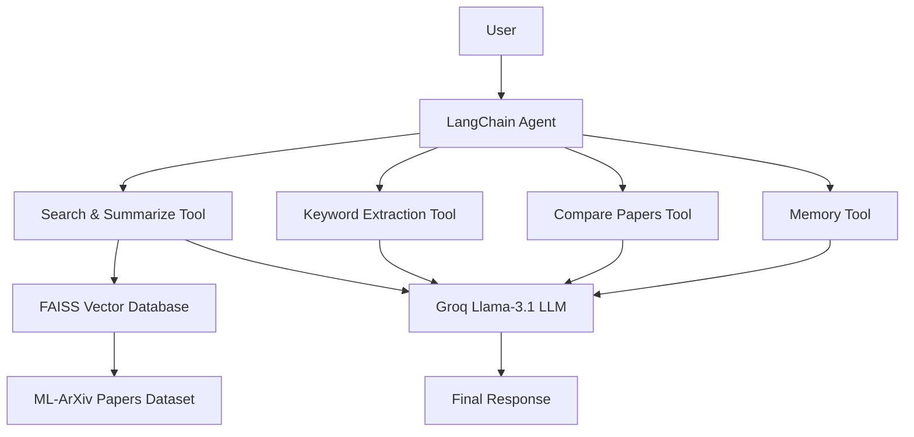

# Research Paper Intelligence System using Agentic AI

### Semantic Search • LangChain Agent • FAISS • Groq LLM • Memory • Research Paper Analysis

---

## 📌 Project Overview

This project is an **Agentic AI-powered Research Paper Intelligence System** designed to help users discover, analyze, and understand research papers efficiently using Large Language Models (LLMs), semantic search, and intelligent tool orchestration.

Unlike traditional search systems, this project uses **LangChain Agents** to automatically decide which tool to use based on the user's query. It combines semantic search, summarization, keyword extraction, paper comparison, and conversational memory into a single intelligent research assistant.

The system integrates **Sentence Transformers**, **FAISS**, **Groq Llama-3.1**, **LangChain**, and **Hugging Face models** to provide accurate and context-aware responses.

---

## ❓ Problem Statement

The number of research papers published every year is growing rapidly, making it difficult for students and researchers to find relevant papers quickly.

Traditional keyword-based search systems often fail to understand the semantic meaning of user queries, resulting in irrelevant search results.

**Key Challenges:**

- Difficulty finding relevant research papers
- Keyword-based search lacks semantic understanding
- Time-consuming manual reading of long abstracts
- No intelligent paper comparison
- No conversational interaction with the system

---

## 🎯 Objectives

- Retrieve research papers using semantic similarity instead of keyword matching
- Build an intelligent LangChain Agent capable of selecting tools automatically
- Generate concise summaries of research papers
- Extract meaningful keywords using NLP
- Compare research papers intelligently
- Maintain conversation memory for follow-up questions
- Improve the overall research paper exploration experience

---

## 📊 Dataset

This project uses the **ML-ArXiv Papers Dataset** available on Hugging Face.

Each record contains:

- Research Paper Title
- Research Paper Abstract

The dataset is used for semantic search, vector embedding generation, research paper retrieval, summarization, and keyword extraction.

**Dataset:** [ML-ArXiv-Papers on Hugging Face](https://huggingface.co/datasets/CShorten/ML-ArXiv-Papers)

---

## ⚙️ Features Implemented

| # | Feature | Description |
|---|---------|-------------|
| 1 | Dataset Loading | Loaded the ML-ArXiv Papers Dataset from Hugging Face |
| 2 | Data Preprocessing | Cleaned and combined titles + abstracts into a single text field |
| 3 | Embedding Generation | Used Sentence Transformers (`all-MiniLM-L6-v2`) for dense vector embeddings |
| 4 | FAISS Vector Database | Built a FAISS index for efficient semantic similarity search |
| 5 | Semantic Search | Retrieved Top-K most relevant papers with similarity scores |
| 6 | Summarization | Used Facebook BART for abstractive summarization |
| 7 | Keyword Extraction | Used KeyBERT to extract key concepts and phrases |
| 8 | Named Entity Recognition | Detected organizations, models, frameworks, and universities |
| 9 | LLM Integration | Configured Groq Llama-3.1-8B-Instant for reasoning and responses |
| 10 | Conversation Memory | Implemented MemorySaver (LangGraph) for follow-up questions |
| 11 | LangChain Tools | Custom tools for search, summarization, comparison, and memory |
| 12 | LangChain Agent | Automatically selects the right tool based on user query |
| 13 | Agent Testing | Tested across semantic search, keyword extraction, comparison, and memory queries |

---

## 🔄 System Workflow

```
Load Dataset → Preprocess Papers → Generate Embeddings → Create FAISS Index
      ↓
Receive User Query → LangChain Agent → Select Appropriate Tool → Execute Tool
      ↓
Groq LLM → Final Response
```

---

## 🏗️ System Architecture



---

## 🛠️ Technologies Used

Python • LangChain • LangGraph • Groq API • Sentence Transformers • FAISS • Hugging Face Transformers • Facebook BART • KeyBERT • Pandas • NumPy • Google Colab

---

## 💡 Example Queries

**Semantic Search**
```
Find the top 2 research papers on Vision Transformer.
```

**Keyword Extraction**
```
Extract the top 5 keywords from Vision Transformer.
```

**Memory**
```
Show my last search.
```

---

## 🚀 Future Scope

- Streamlit Web Application
- PDF Upload Support
- Multi-document Question Answering
- Citation Generation
- Research Recommendation Engine
- Multi-Agent Architecture
- Cloud Deployment

---

## 📝 Conclusion

This project demonstrates how Agentic AI can simplify research paper discovery using semantic search, intelligent tool selection, and Large Language Models.

By integrating LangChain Agents, FAISS, Groq LLM, and Hugging Face models, the system provides an intelligent research assistant capable of retrieving, summarizing, comparing, and analyzing research papers while maintaining conversational memory.

---

## 📚 Key Learnings

Agentic AI • LangChain Agents • LangGraph • Tool Calling • Semantic Search • Sentence Embeddings • FAISS Vector Database • Research Paper Summarization • Keyword Extraction • Named Entity Recognition • Conversational Memory • Groq LLM Integration

---

## 👤 Author

**Uttam Pachauri**
B.Tech Computer Science Engineering

Interested in: Artificial Intelligence • Machine Learning • Natural Language Processing • Agentic AI • Data Analytics

---

## 🙏 Acknowledgement

This project was developed as part of my learning in **Agentic AI**, **Natural Language Processing**, and **Large Language Models**. It helped me gain practical experience in semantic search, vector databases, LangChain Agents, conversational memory, and intelligent tool orchestration while building an end-to-end AI-powered research paper intelligence system.
